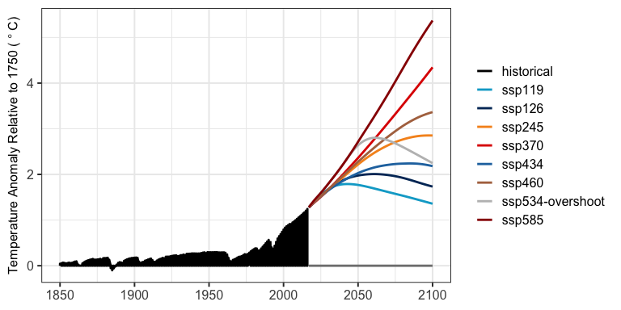

<!-- README.md is generated from README.Rmd. Please edit this file then run devtools::build_readme() -->

# hector

[](https://zenodo.org/badge/latestdoi/22892935)
[](https://github.com/JGCRI/hector/actions/workflows/unit-testing.yaml)
[](https://github.com/JGCRI/hector/actions/workflows/command-line.yaml)
[](https://github.com/JGCRI/hector/actions/workflows/R-CMD-check.yaml)
[](https://codecov.io/gh/JGCRI/hector)

This is the repository for **Hector**, an open source, object-oriented,
simple global climate carbon-cycle model that runs very quickly while
still representing the most critical global scale earth system
processes. Hector is a simple climate model (SCM, also known as a
reduced-complexity climate model), a class of models that are extremely
versatile with a wide range of applications. Due to their computational
efficiency, SCMs can easily be coupled to other models and used to
design scenarios, emulate more complex climate models, and conduct
uncertainty analyses.



Hector’s output for global mean air temperature change for eight Shared
Socioeconomic Pathways (SSPs).

## Installation

The `hector` R package can be installed using the
`remotes::install_github` function. More detailed installation
instructions, including how to set up Hector as a command line
executable, can be found [here](articles/BuildHector.html).

``` r
remotes::install_github('jgcri/hector')
library(hector)
```

## Tools and Software That Work with Hector

- [GCAM](https://github.com/JGCRI/gcam-core): Hector can be used as the
  climate component in [GCAM](http://jgcri.github.io/gcam-doc/)
- [pyhector](https://github.com/openclimatedata/pyhector): a Python
  interface to Hector
- [fldgen](https://github.com/JGCRI/fldgen): a spatially resolved
  temperature & precipitation emulator for CMIP5 ESMs
- [HectorUI](https://jgcri.shinyapps.io/HectorUI/): run Hector in a web
  interface!

## Contributing to Hector

The Hector team welcomes and values community contributions, but please
see our [Contribution Guide](vignettes/articles/ContributionsGuide.Rmd)
and note by contributing to this project, you agree to abide to our
[Contributor Code of Conduct](CODE_OF_CONDUCT.md)

------------------------------------------------------------------------

This research was supported by the U.S. Department of Energy, Office of
Science, as part of research in Multi-Sector Dynamics, Earth and
Environmental System Modeling Program. The Pacific Northwest National
Laboratory is operated for DOE by Battelle Memorial Institute under
contract DE-AC05-76RL01830.
