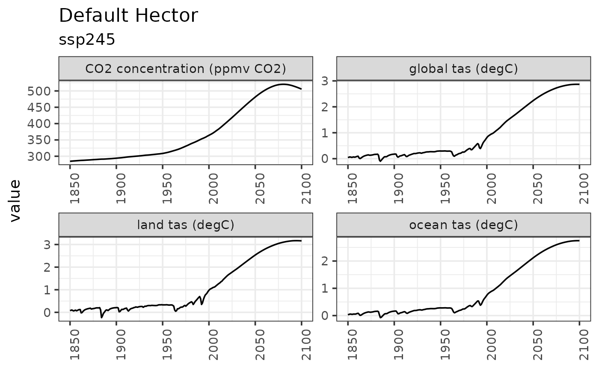
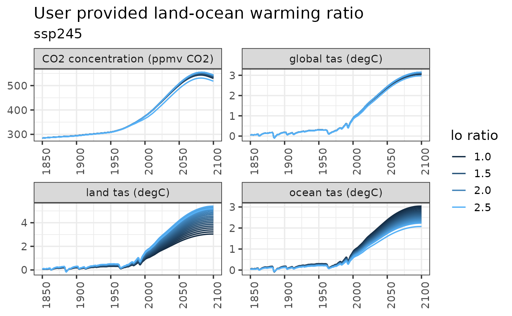
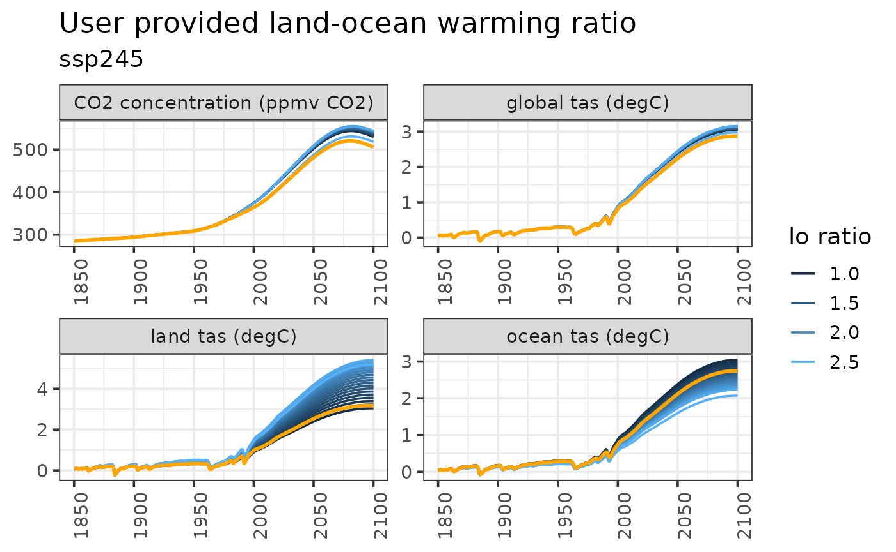

# Land Ocean Warming

## Introduction

Hector uses DOECLIM[^1], a diffusion ocean-energy balance, to calculate
mean global air temperature from sea-surface and land-surface
temperature anomalies. DOECLIM can simulate the different rates of
warming over land and ocean surfaces, meaning that the land-ocean
warming ratio is an emergent property of Hector. However, users also
have the option to provide a land-ocean warming ratio to be used in
place of DOECLIM’s internal calculations. This enables Hector to emulate
the land-ocean warming dynamics of specific Earth System Models.

This vignette demonstrates how providing a user-defined land-ocean
warming ratio can affect Hector output.

## Setup

``` r

library(ggplot2)
library(hector)

theme_set(theme_bw(base_size = 14))
```

## Run default Hector

Complete a default run of Hector, one that uses DOECLIM to calculate
land and ocean air temperature.

``` r

years_to_keep <- 1850:2100
vars_to_keep <- c(GLOBAL_TAS(), LAND_TAS(), OCEAN_TAS(), CONCENTRATIONS_CO2())

inifile <- file.path(system.file("input", package = "hector"), "hector_ssp245.ini")

core    <- newcore(inifile)
run(core, max(years_to_keep))
```

    ## Hector core: Unnamed Hector core
    ## Start date:  1745
    ## End date:    2300
    ## Current date:    2100
    ## Input file:  /home/runner/work/_temp/Library/hector/input/hector_ssp245.ini

``` r

out1 <- fetchvars(core, years_to_keep, vars_to_keep)
out1$scenario <- "default"
out1$variable <- paste0(gsub(out1$variable, pattern = "_", replacement = " "),
                        " (", out1$units, ")")
```

``` r

ggplot(data = out1) +
    geom_line(aes(year, value)) +
    facet_wrap("variable", scales = "free") +
    labs(title = "Default Hector",
         subtitle = "ssp245",
         x = NULL) +
    theme(axis.text.x = element_text(angle = 90))
```



## Run Hector with different land ocean warming ratios

Start by writing a function to help us set the land ocean warming ratio,
run Hector, and fetch some results.

``` r

# Helper function that runs a Hector core with a new land-ocean warming ratio.
#
# Args
#   hc: an active Hector core
#   value: the land ocean warming ratio to use
# Return: data frame of Hector results
run_with_lo <- function(hc, value) {

    # Set the land ocean warming ratio
    setvar(hc, NA, LO_WARMING_RATIO(), value, getunits(LO_WARMING_RATIO()))

    # Reset and run Hector
    reset(hc)
    run(hc)

    # Fetch and format the output
    out <- fetchvars(hc, years_to_keep, vars_to_keep)
    out$scenario <- value
    out$variable <- paste0(gsub(out$variable, pattern = "_", replacement = " "),
                           " (", out$units, ")")

    return(out)
}

# Make a vector of the land ocean warming ratios to test out
lo_to_use <- seq(from = 1, to = 2.5, length.out = 20)

# Apply our helper function to the various land ocean warming ratio values and
# concatenate the results into a single data frame
results_list <- lapply(lo_to_use, run_with_lo, hc = core)
hector_lo_results <- do.call(results_list, what = "rbind")
```

## Plot the results

``` r

ggplot(data = hector_lo_results) +
    geom_line(aes(year, value, color = scenario, group = scenario)) +
    facet_wrap("variable", scales = "free") +
    labs(title = "User provided land-ocean warming ratio",
         subtitle = "ssp245",
         x = NULL,
         y = NULL) +
    theme(axis.text.x = element_text(angle = 90)) +
    guides(color = guide_legend(title = "lo ratio"))
```



## Compare default Hector with user provided land ocean warming ratio

``` r

last_plot() +
    geom_line(data = out1, aes(year, value), color = "orange", size = 1)
```

    ## Warning: Using `size` aesthetic for lines was deprecated in ggplot2 3.4.0.
    ## ℹ Please use `linewidth` instead.
    ## This warning is displayed once per session.
    ## Call `lifecycle::last_lifecycle_warnings()` to see where this warning was
    ## generated.



[^1]: Kriegler, E. (2005). Imprecise probability analysis for integrated
    assessment of climate change. Ph.D. thesis. Potsdam URL: Universität
    Potsdam.
    [https://www.pik‐potsdam.de/members/edenh/theses/PhDKriegler.pdf](https://www.pik%E2%80%90potsdam.de/members/edenh/theses/PhDKriegler.pdf)
