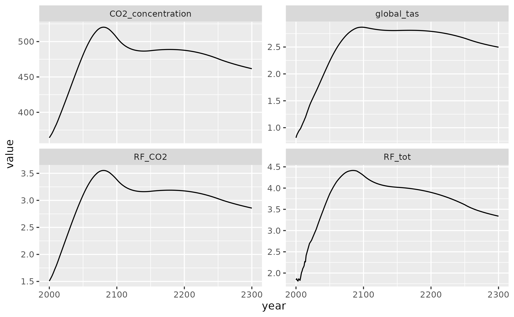
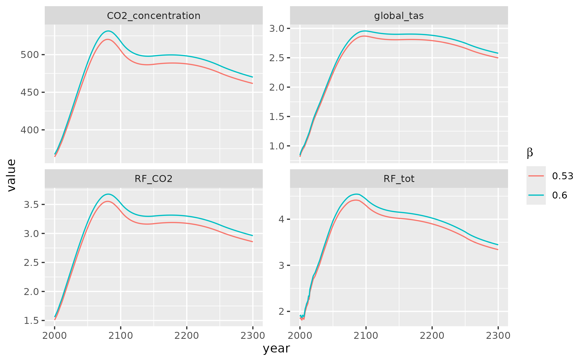
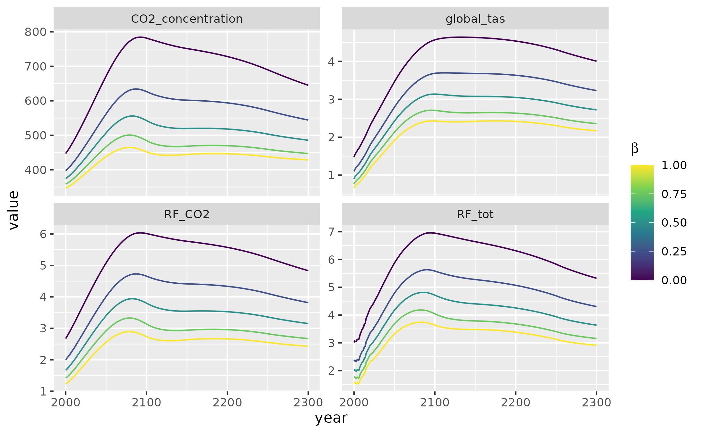

# hector

This vignette provides a basic introduction for running Hector with R,
assuming that Hector is already installed. First, it shows how to do a
simple Hector run with a built-in scenario. It then demonstrates how to
modify Hector parameters from within R to perform a simple sensitivity
analysis of how the CO$`_2`$ fertilization parameter $`\beta`$ affects
several Hector output variables.

## Basic run

First, load the `hector` package.

``` r

library(hector)
```

Hector is configured via an INI file, which defines run metadata, inputs
(e.g., emissions scenarios), and parameters. For details on this file,
see [InputFiles](https://jgcri.github.io/hector/articles/InputFiles.md).

These files ship with the Hector R package in the `input/` subdirectory,
which allows them to be accessed via `system.file`. First, determine the
path of the input file (ini) corresponding to the scenario
[SPP245](https://en.wikipedia.org/wiki/Shared_Socioeconomic_Pathways).

``` r

ini_file <- system.file("input/hector_ssp245.ini", package = "hector")
```

Alternatively, users may provide a path to an ini file external to the
Hector package on their local machine. This file must comply with the
Hector [ini
requirements](https://jgcri.github.io/hector/articles/InputFiles.md).

``` r

external_ini_file <- "/path/to/ini/on/local/machine/my_ini.ini"
```

Next, we initialize a Hector instance, or “core”, using this
configuration. This core is a self-contained object that contains
information about all of Hector’s inputs and outputs. The core is
initialized via the `newcore` function:

``` r

core <- newcore(ini_file)
core
```

    ## Hector core: Unnamed Hector core
    ## Start date:  1745
    ## End date:    2300
    ## Current date:    1745
    ## Input file:  /home/runner/work/_temp/Library/hector/input/hector_ssp245.ini

Now that we have configured a Hector core, we can run it with the `run`
function.

``` r

run(core)
```

    ## Hector core: Unnamed Hector core
    ## Start date:  1745
    ## End date:    2300
    ## Current date:    2300
    ## Input file:  /home/runner/work/_temp/Library/hector/input/hector_ssp245.ini

Notice that this itself returns no output. Instead, the output is stored
inside the core object. To retrieve it, we use the
[`fetchvars()`](https://jgcri.github.io/hector/reference/fetchvars.md)
function. Below, we also specify that we want to retrieve results from
2000 to 2300.

``` r

results <- fetchvars(core, 2000:2300)
head(results)
```

    ##              scenario year          variable    value    units
    ## 1 Unnamed Hector core 2000 CO2_concentration 364.0759 ppmv CO2
    ## 2 Unnamed Hector core 2001 CO2_concentration 365.6111 ppmv CO2
    ## 3 Unnamed Hector core 2002 CO2_concentration 367.0735 ppmv CO2
    ## 4 Unnamed Hector core 2003 CO2_concentration 368.6459 ppmv CO2
    ## 5 Unnamed Hector core 2004 CO2_concentration 370.2777 ppmv CO2
    ## 6 Unnamed Hector core 2005 CO2_concentration 372.1309 ppmv CO2

The results are returned as a long `data.frame`. This makes it easy to
plot them using `ggplot2`.

``` r

library(ggplot2)

ggplot(results) +
  aes(x = year, y = value) +
  geom_line() +
  facet_wrap(~variable, scales = "free_y")
```



By default,
[`fetchvars()`](https://jgcri.github.io/hector/reference/fetchvars.md)
returns the four outputs shown above – atmospheric CO$`_2`$
concentration, CO$`_2`$ radiative forcing, total radiative forcing, and
temperature change – but any model output(s) can be specified.

## Setting parameters

The Hector R interface interacts with parameters and variables in the
same way. Therefore, the variables can be set and checked via
[`setvar()`](https://jgcri.github.io/hector/reference/setvar.md) and
[`fetchvars()`](https://jgcri.github.io/hector/reference/fetchvars.md).

First, let’s get the current value of $`\beta`$ (beta), the CO$`_2`$
fertilization factor. Because variables and parameter names have to be
retrieved from the Hector core, they are stored as R functions
(e.g. [`BETA()`](https://jgcri.github.io/hector/reference/parameters.md)).
However, these functions return a string corresponding to the variable
name.

``` r

BETA()
```

    ## [1] "beta"

Just as we did to load results, we use
[`fetchvars()`](https://jgcri.github.io/hector/reference/fetchvars.md)
to query parameter values.

``` r

beta <- fetchvars(core, NA, BETA())
beta
```

    ##              scenario year variable value      units
    ## 1 Unnamed Hector core   NA     beta  0.65 (unitless)

The result of
[`fetchvars()`](https://jgcri.github.io/hector/reference/fetchvars.md)
is always a `data.frame` with the same columns, even when returning a
parameter value. Note also the use of `NA` in the second argument
(`dates`).

The current value is set to 0.53 (note that it is a unitless quantity,
hence the `(unitless)` unit). Let’s bump it up a little to 0.60.

``` r

setvar(core, NA, BETA(), 0.60, "(unitless)")
```

Similarly to `run`, this returns no output. Rather, the change is stored
inside the Hector “core” object. We can confirm that our change took
effect with another call to
[`fetchvars()`](https://jgcri.github.io/hector/reference/fetchvars.md).

``` r

fetchvars(core, NA, BETA())
```

    ##              scenario year variable value      units
    ## 1 Unnamed Hector core   NA     beta   0.6 (unitless)

Now, let’s run the simulation again with a higher value for CO$`_2`$
fertilization. But, before we do, let’s look once again at the Hector
`core` object.

``` r

core
```

    ## Hector core: Unnamed Hector core
    ## Start date:  1745
    ## End date:    2300
    ## Current date:    2300
    ## Input file:  /home/runner/work/_temp/Library/hector/input/hector_ssp245.ini

Notice that `Current date` is set to 2300. This is because we have
already run this core to its end date. The ability to stop and resume
Hector runs with the same configuration, possibly with adjusting values
of certain variables while stopped, is an essential part of the model’s
functionality. But, it’s not something we’re interested in here. We have
already stored the previous run’s output in `results` above, so we can
safely reset the core:

``` r

reset(core)
```

    ## Hector core: Unnamed Hector core
    ## Start date:  1745
    ## End date:    2300
    ## Current date:    1745
    ## Input file:  /home/runner/work/_temp/Library/hector/input/hector_ssp245.ini

This effectively ‘rewinds’ the core back to either the provided `date`
(defaults to 0 if missing) or the model start date (set in the INI file;
default is 1745), whichever is greater. In addition, if the `date`
argument is less than the model start date and spinup is enabled
(`do_spinup = 1` in the INI file), then the core will re-do its spinup
process with the current set of parameters.

------------------------------------------------------------------------

**NOTE**

Prior to a normal run beginning in 1745, Hector has an optional “spinup”
mode where it runs the carbon cycle with no perturbations until it
stabilizes. Essentially, the model removes human emissions and runs
until there are no more changes in the carbon pools and the system has
reached equilibrium.

Because changing Hector parameters can change the post-spinup
equilibrium values of state variables, Hector will automatically run
`reset(core, date = 0)` at the beginning of the next `run` call if it
detects that any of its parameters have changed. This means that it is
not currently possible to change Hector *parameters* (such as $`\beta`$
or preindustrial CO₂) part-way through a run. However, it is still
possible to change the values of specific *drivers* and *state
variables* (such as the CO₂ emissions) in the middle of a run.

------------------------------------------------------------------------

So, as a result of the `reset` command, the core’s `Current Date` is now
the model start date – 1745. We can now perform another run with the new
CO$`_2`$ fertilization value.

``` r

run(core)
```

    ## Hector core: Unnamed Hector core
    ## Start date:  1745
    ## End date:    2300
    ## Current date:    2300
    ## Input file:  /home/runner/work/_temp/Library/hector/input/hector_ssp245.ini

``` r

results_60 <- fetchvars(core, 2000:2300)
head(results_60)
```

    ##              scenario year          variable    value    units
    ## 1 Unnamed Hector core 2000 CO2_concentration 367.3076 ppmv CO2
    ## 2 Unnamed Hector core 2001 CO2_concentration 368.9244 ppmv CO2
    ## 3 Unnamed Hector core 2002 CO2_concentration 370.4680 ppmv CO2
    ## 4 Unnamed Hector core 2003 CO2_concentration 372.1210 ppmv CO2
    ## 5 Unnamed Hector core 2004 CO2_concentration 373.8332 ppmv CO2
    ## 6 Unnamed Hector core 2005 CO2_concentration 375.7668 ppmv CO2

Let’s see how changing the CO$`_2`$ fertilization affects our results.

``` r

results[["beta"]] <- 0.53
results_60[["beta"]] <- 0.60
compare_results <- rbind(results, results_60)

ggplot(compare_results) +
  aes(x = year, y = value, color = factor(beta)) +
  geom_line() +
  facet_wrap(~variable, scales = "free_y") +
  guides(color = guide_legend(title = expression(beta)))
```



As expected, increasing CO$`_2`$ fertilization increases the strength of
the terrestrial carbon sink and therefore reduces atmospheric CO$`_2`$,
radiative forcing, and global temperature. However, the effects only
become pronounced in the latter half of the 21st century.

## Sensitivity analysis

Hector runs quickly, making it easy to run many simulations under
slightly different configurations. One application of this is to explore
the sensitivity of Hector to variability in its parameters. This is an
example of a basic sensitivity analysis, where we change Hector
parameter values and look at the impacts on Hector output. For users
that are interested in more advanced sensitivity analyses or may be
probabilistic Hector runs we recommend using
[Matilda](https://github.com/JGCRI/matilda)! Matilda is a package that
provides a probabilistic framework to the Hector simple climate model.
Now to continue with this example.

The basic procedure for this is the same as in the previous section.
However, to save typing (and, in general, to be good programmers!),
let’s create some functions.

``` r

#' Run Hector with a parameter set to a particular value, and return results
#'
#' @param core Hector core to use for execution
#' @param parameter Hector parameter name, as a function call (e.g. `BETA()`)
#' @param value Parameter value
#' @return Results, as data.frame, with additional `parameter_value` column
run_with_param <- function(core, parameter, value) {
  setvar(core, NA, parameter, value, getunits(parameter))
  reset(core)
  run(core)
  result <- fetchvars(core, 2000:2300)
  result[["parameter_value"]] <- value
  result[["parameter_units"]] <- getunits(parameter)
  result
}

#' Run Hector with a range of parameter values
run_with_param_range <- function(core, parameter, values) {
  mapped <- Map(function(x) run_with_param(core, parameter, x), values)
  Reduce(rbind, mapped)
}

sensitivity_beta <- run_with_param_range(core, BETA(), seq(0, 1, length.out = 5))

ggplot(sensitivity_beta) +
  aes(x = year, y = value, color = parameter_value, group = parameter_value) +
  geom_line() +
  facet_wrap(~variable, scales = "free_y") +
  guides(color = guide_colorbar(title = expression(beta))) +
  scale_color_viridis_c()
```



As we can see, the ability of CO$`_2`$ fertilization to offset carbon
emissions saturates, at high values of $`\beta`$, the same increase in
$`\beta`$ translates into a smaller decrease in atmospheric CO$`_2`$ and
related climate effects.
