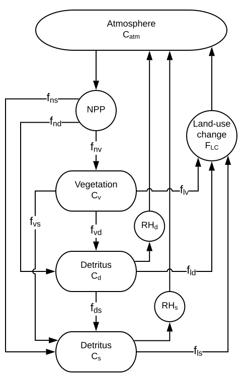

Contents:

- [Scientific basis](#simplenbox-science) behind the terrestrial C cycle
- [Implementation details](#simplenbox-implementation)

# Science {#simplenbox-science}

Hector's land C sink is divided into three pools: vegetation ($C_v$), detritus ($C_d$), and soil ($C_s$).
These sinks are global by default, but they can be divided into $n$ "biomes" with unique parameters and initial pool sizes.

The total C flux from atmosphere to land at time $t$ ($F_{L}(t)$) is the net of C sequestration by photosynthesis (net primary productivity, $NPP_i(t)$) and C release by heterotrophic respiration ($RH_i(t)$) summed across each biome $i$, and global land use change ($LUC(t)$):

$$ F_{L}(t) = \sum_{i=1}^{n} \left( NPP_i(t) - RH_i(t) \right) - LUC(t)  $$

NPP is calculated as the product of a user-specified pre-industrial value ($NPP_0$, default is 50 PgC/year) and a CO~2~ fertilization multiplier ($f(C_{atm}, \beta)$), which in turn is a function of the current atmospheric CO~2~ concentration ($C_{atm}$), the initial ("pre-industrial") CO~2~ concentration ($C_0$), and biome-specific CO~2~ fertilization parameter $\beta_i$ (default = 0.36):

$$ NPP_i(t) = NPP_{0,i} \times f(C_{atm}, \beta_i) $$
$$ f(C_{atm}, \beta_i) = 1 + \beta_i \left( \log(\frac{C_{atm}}{C_0})\right) $$

Heterotrophic respiration occurs in soil ($RH_s(t)$) and detritus ($RH_d(t))$) as a function of biome-specific atmospheric temperature anomaly ($T_i$, calculated as the global atmospheric temperature anomaly scaled by a biome-specific warming factor $\delta$) and the size of the current soil and detritus C pools ($C_s$ and $C_d$, respectively).

$$ T_i(t) = \delta \, T_G(t) $$
$$ RH_s = \frac{1}{50} C_s Q_{10}^{T_{i}(t) / 10}$$
$$ RH_d = \frac{1}{4} C_d Q_{10}^{T_{i}(t) / 10}$$

Note that the residence times of soil and detritus C pools---50 and 4 years, respectively---are currently hard-coded values in Hector.

Fluxes associated with land use change ($LUC$) are prescribed via the `luc_emissions` variable in the INI value.
Example time series associated with representative carbon pathways (RCP) 2.6, 4.5, 6.0, and 8.5 are included with Hector in the corresponding `inst/input/emissions/RCP**_emissions.csv` files.

In each biome at each time step, the vegetation pools change as follows (biome, $i$ and time, $t$ subscripts omitted for clarity):
C gain from NPP is distributed to vegetation, detritus, and soil according to fractionation parameters $f_{nv}$, $f_{nd}$, and $f_{ns}$, respectively.
Similarly, each pool bears a fraction of the total C loss from land-use change ($F_{LC}$), again according to fractions $f_{lv}$, $f_{ld}$, and $f_{ls}$.
The detritus and soil pools also lose C via heterotrophic respiration ($RH_d$ and $RH_s$, respectively).
Finally, a fixed fraction of vegetation C is transferred to detritus as litterfall ($f_{vd}$), and a fraction of both vegetation ($f_{vs}$) and detritus ($f_{ds}$) C are transferred to soil.

$$ \frac{dC_v}{dt} = NPP\, f_{nv} - C_v (f_{vd} + f_{vs}) - F_{LC} f_{lv} $$
$$ \frac{dC_d}{dt} = NPP\, f_{nd} + C_v f_{vd} - C_d f_{ds} - RH_d - F_{LC} f_{ld} $$
$$ \frac{dC_s}{dt} = NPP\, f_{ns} + C_v f_{vs} - C_d f_{ds} - RH_s - F_{LC} f_{ls} $$

The entire terrestrial C cycle is summarized in the following diagram:

```{r terrestrial-c-diagram, echo = FALSE, fig.cap = terrestrial_c_cap}
terrestrial_c_cap <- paste(
  "Summary of terrestrial C cycle in Hector.",
  'The full Hector C cycle also includes ocean and "Earth" C pools',
  "that exchange C with the atmosphere, but these are omitted for clarity."
)

# Edit this diagram at:
# https://www.lucidchart.com/invitations/accept/895610d2-ee0e-453f-a5fa-2334171e5b54
# (Free LucidChart account required.)
```

# Implementation {#simplenbox-implementation}

The state of the global C cycle in Hector is defined by a length 6 vector `c`, which describes the amount of C (in Pg C) in the atmosphere (0), vegetation (1), detritus (2), soil (3), ocean (4), and "Earth" (5) at the current time step.
At each Hector time step, `c` is solved by the `CarbonCycleSolver::run()` function (defined in [`src/carbon-cycle-solver.cpp`][solver]) in the following general steps:

1. Retrieve the current estimates of various pools from variables defined by the C cycle model and assign them to the relevant parts of `c` (`getCValues`).
2. Integrate from the beginning of the time step using updated slow parameters (`slowparameval`).
3. Solve the ordinary differential equations associated with the C cycle model based on its time derivatives (defined in `calcderivs`).
4. Re-calculate C cycle model internal variables based on the solved values of `c` (`stashCValues`).
5. Record the model state (`record_state`).

These steps are described in more detail below.
The complete code for the terrestrial C cycle lives in [`src/simpleNbox.cpp`][cpp] file (with associated headers in [`inst/include/simpleNbox.hpp`][hpp]).

[solver]: https://github.com/JGCRI/hector/blob/master/src/carbon-cycle-solver.cpp
[cpp]: https://github.com/jgcri/hector/blob/master/src/simpleNbox.cpp
[hpp]: https://github.com/JGCRI/hector/blob/master/inst/include/simpleNbox.hpp

## Setting the `c` vector (`getCValues`)

This function sets the values of the `c` vector to the corresponding state variables in the C cycle model.

- The atmospheric C pool for the current time step is defined by `atmos_c`, which is always a scalar unit quantity (because CO~2~ is assumed to be well-mixed in the atmosphere).

- Vegetation, detritus, and soil pools at the current time step are stored in `veg_c`, `detritus_c`, and `soil_c`, respectively.
These are vector quantities ("stringmaps"), with one value for each biome (the default biome name is "global"), so the value stored in the corresponding slot in `c` is the sum across all biomes.
The ocean C pool is retrieved by a call to the current ocean model's `getCValues` function.
(NOTE: This means that `simpleNBox` model depends on the existence of an ocean C cycle model.)

- Finally, the "Earth" C pool is stored in `earth_c`, which is also a scalar unit quantity.

All of these variables have are in units Pg C.

## Slow parameter evaluation (`slowparameval`)

- Perform the ocean C model's slow parameter evaluation (`omodel->slowparameval`)

- Calculate CO~2~ fertilization effect for each biome (`co2fert[biome]`) using the function `calc_co2fert`
    - ...unless you are in the spin-up phase, in which case assume no effect (`co2fert = 1`)
    
- Calculate temperature effect on respiration of detritus (`tempfertd`) and soil (`tempferts`).
    - Note that soil warming is "sticky" -- it can only increase, not decline (even if the temperature declines between time steps)
    - Note also that while detritus warming is based on the actual current biome temperature, the soil warming is based on a 200-year running mean
    
Note that these effect parameters are calculated but not yet applied.
They will be applied to the actual NPP and RH estimates during the ODE solving loop.

## C cycle derivatives (`calcderivs`)

- Calculate NPP for each biome (`npp` function)
- Partition NPP C gain into vegetation, detritus, and soil pools according to fractions
- Calculate RH for detritus and soil
- Partition C losses from RH accirding to fractions
- Calculate and partition litter flux
- Store changes in pools in `dcdt` vector (same structure as `c`)

## Storing the results (`stashCValues`)

- Reset the atmospheric CO~2~ state variable (`atmos_c`) to the current value from `c`
- Calculate the difference between vegetation, detritus, and soil C calculated by the ODE solver (i.e. in `c`) and what was stored in the current state variables (`veg_c`, `detritus_c`, `soil_c`). Store these differences in `veg_delta`, `det_delta`, `soil_delta`.
- Apply these additional fluxes to each biome, weighing by the biome's current gross primary productivity (`NPP + RH`). I.e.:
    - Calculate the total GPP across all biomes (`npp_rh_total = sum_npp() + sum_rh()`)
    - Calculate each biome's weight (`wt[biome] = (npp(biome) + rh(biome)) / npp_rh_total`)
    - Add the corresponding difference multiplied by the weight to the biome's current pool (e.g. `veg_c[biome] = veg_c[biome] + veg_delta * wt[biome]`)
    - NOTE: This is a workaround. In the future, Hector will use the ODE solver to separately solve all of the boxes in the multi-biome system.
- Stash the ocean C pools using the `omodel->stashCValues` function
- Stash the Earth C pool (`earth_c`)
- Check for mass conservation by take the sum of `c` (total C in system) and comparing it against the sum from the previous timestep (`masstot`).
    - NOTE: This check is skipped the first time this function is evaluated, at which point `masstot` is initialized to the calculated sum.
- If Hector is running under atmospheric CO~2~ constraint, re-calculate the atmospheric CO~2~ pool to match the constraint and move any residual C to/from the deep ocean pool.

## Recording the state (`record_state`)

This just sets the time-series versions of all of the C cycle state variables (e.g. `atmos_c_ts`, `veg_c_tv`, `detritus_c_tv`, `tempfertd_tv`) to their corresponding state variables at the current time step (e.g. `atmos_c`, `veg_c`, `detritus_c`, `tempfertd`).

## Setting (`setData`) and retrieving (`getData`) values {#simplenbox-setdata}

The following values related to the terrestrial C cycle can be set via `setData`.


| Description                        | Unit       | C++ macro                  | R function            | C++ variable    | Needs date | Biome-specific | Set | Get |
|------------------------------------|------------|----------------------------|-----------------------|-----------------|------------|----------------|-----|-----|
| Initial atmospheric CO~2~ pool     | PgC        | `D_ATMOSPHERIC_C`          | `ATMOSPHERIC_C()`     | `C0`            | No         | No             | Yes | Yes |
| Pre-industrial CO~2~ concentration | ppmv CO~2~ | `D_PREINDUSTRIAL_C02`      | `PREINDUSTRIAL_CO2()` | `C0`            | No         | No             | Yes | Yes |
| Atmospheric C constraint residual  | ppmv CO~2~ | `D_ATMOSPHERIC_C_RESIDUAL` |                       | `residual`      | No         | No             | No  | Yes |
| Vegetation C pool                  | PgC        | `D_VEGC`                   |                       | `veg_c`         | No         | Yes            | Yes | Yes |
| Detritus C pool                    | PgC        | `D_DETRITUSC`              |                       | `detritus_c`    | Yes        | Yes            | Yes | Yes |
| Soil C pool                        | PgC        | `D_SOILC`                  |                       | `soil_c`        | No         | Yes            | Yes | Yes |
| Radiative forcing from albedo      | unitless   | `D_RF_T_ALBEDO`            | `RF_T_ALBEDO()`       | `Ftalbedo`      | Yes        | No             | Yes | Yes |
| Frac. NPP to vegetation            | unitless   | `D_F_NPPV`                 | `F_NPPV()`            | `f_nppv`        | No         | Yes            | Yes | Yes |
| Frac. NPP to detritus              | unitless   | `D_F_NPPD`                 | `F_NPPD()`            | `f_nppd`        | No         | Yes            | Yes | Yes |
| Frac. veg. C to litter             | unitless   | `D_F_LITTERD`              | `F_LITTERD()`         | `f_litterd`     | No         | Yes            | Yes | Yes |
| Frac. LUC from vegetation          | unitless   | `D_F_LUCV`                 | `F_LUCV()`            | `f_lucv`        | No         | No             | Yes | Yes |
| Frac. LUC from detritus            | unitless   | `D_F_LUCD`                 | `F_LUCD()`            | `f_lucd`        | No         | No             | Yes | Yes |
| Initial NPP flux                   | PgC / year | `D_NPP_FLUX0`              |                       | `npp_flux0`     | No         | Yes            | Yes | Yes |
| Fossil fuel CO~2~ emissions        | PgC / year | `D_FFI_EMISSIONS`          | `FFI_EMISSIONS()`     | `ffiEmissions`  | Yes        | No             | Yes | Yes |
| LUC emissions                      | PgC / year | `D_LUC_EMISSIONS`          | `LUC_EMISSIONS()`     | `lucEmissions`  | Yes        | No             | Yes | Yes |
| Atmospheric CO2 constraint         | ppmv CO~2~ | `D_CA_CONSTRAIN`           |                       | `Ca_constrain`  | Yes        | No             | Yes | No  |
| CO~2~ fertilization factor         | unitless   | `D_BETA`                   | `BETA()`              | `beta`          | No         | Yes            | Yes | Yes |
| Biome warming multiplier           | unitless   | `D_WARMINGFACTOR`          |                       | `warmingfactor` | No         | Yes            | Yes | Yes |
| RH temperature sensitivity         | unitless   | `D_Q10_RH`                 | `Q10_RH()`            | `q10_rh`        | No         | Yes            | Yes | Yes |

## Other routines

- `init()` -- Initialize the C cycle model
    - Set inital values for the default biome (`"global"`) for the following variables:
        - `co2fert` (CO~2~ fertilization multiplier) -- 1.0
        - `warmingfactor` (biome warming multiplier relative to global average) -- 1.0
        - `residual` (difference between modeled atmospheric CO~2~ and constraint) -- 0
        - `tempfertd`, `tempferts` (Q10 warming effects on detritus and soil respiration, respectively) -- 1.0
    - Add `"global"` to the biome list
    - Register C cycle model capabilities, dependencies, and inputs
- `reset(time)` -- Resets the state of the C model to time `time`.
    - Set the values of all current-time state variables (e.g. `atmos_c`, `veg_c`, `tempfertd`) to their time-series values at time `time` (e.g. `atmos_c_ts.get(time)`, `veg_c_tv.get(time)`, `tempfertd_tv.get(time)`)
    - Re-calculate the CO~2~ fertilization effect for each biome (`co2fert`). If in spinup, force this to 1.0.
    - "Truncate" all time series variables up to the current time; i.e. `erase` all of the values after `time`
    - Set `tcurrent` to `time`
- `sanitychecks()` -- Ensures the validity of the current model state. Specific checks are:
    - All pools and fluxes (for each biome) must be greater than or equal to 0
    - Partitioning fraction parameters (e.g. `f_nppv`, `f_litterd`) must be between 0 and 1, and must sum to 1
- `prepareToRun()` -- Perform final checks and variable initialization before running a simulation
    - Check that all biome-specific pools, fluxes, and parameters have data for all biomes. (The only optional biome-specific parameter is `warmingfactor`, which is set to 1.0 if missing). Also check that biome-specific CO~2~ fertilization (`beta`) and Q10 (`q10_rh`) parameters are valid.
    - If no albedo forcing data are provided, set the value to the MAGICC default of -0.2
    - Initialize the atmosphic CO~2~ concentration (`Ca`, ppm) and C pool (`atmos_c`, PgC) to the user-specified initial value (`C0`; converted accordingly to PgC for `atmos_c`)
    - Run the checks in `sanitychecks()`
